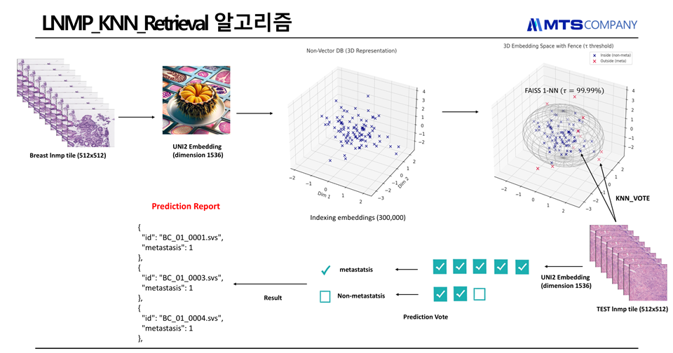

# LNMP_KNN_Retrieval

## 📌 개요
본 프로젝트는 **유방암 림프절 전이(LNMP, Lymph Node Metastasis Prediction)** 판별을 위해
타일 단위 임베딩을 활용한 **KNN 기반 Retrieval 알고리즘**을 구현한 것입니다.

- 입력: 512 x 512 병리 타일 (WSI 기반)
- 임베딩 모델: **UNI2-h (ViT-H/14, 1536차원)**
- 벡터 검색: **FAISS k-NN (τ = 99.99% 분위수 임계치 적용)**
- 최종 판정: 다수결 기반 투표(KNN_VOTE)로 슬라이드 단위 **Non-metastasis 여부** 판정

---

## 🖼 알고리즘 개요 다이어그램


---

## 🧩 알고리즘 절차
1. **Tile Extraction**: 512x512 크기의 WSI 타일 추출  
2. **Embedding**: UNI2-h 모델로 1536차원 벡터화  
3. **Indexing**: ChromaDB 및 FAISS GPU index 구축  
4. **Thresholding**: non-metastasis 분포에서 τ=99.99% 값으로 Fence 설정  
5. **Retrieval & Voting**:  
   - Query 타일의 최근접 k=5 이웃 탐색  
   - 모든 이웃이 fence 밖일 경우 → 전이 의심 후보  
   - 다수결/만장일치 조건에 따라 최종 판정  
6. **Slide-level Aggregation**:  
   - 조건 만족 시 슬라이드 전체를 **전이 없음(Non-metastasis)** 으로 판정  

---

## 📊 Prediction Report 예시
```json
[
  {
    "id": "BC_01_0001.svs",
    "metastasis": 1
  },
  {
    "id": "BC_01_0003.svs",
    "metastasis": 1
  },
  {
    "id": "BC_01_0004.svs",
    "metastasis": 1
  }
]

---

---

📈 성능 평가 (Performance Metrics)
📌 2025-09-08

Performance Metrics

| Metric               | Value | 95% CI          |
| -------------------- | ----- | --------------- |
| Accuracy             | 0.520 | \[0.380, 0.660] |
| Precision            | 0.517 | \[0.333, 0.692] |
| Sensitivity (Recall) | 0.600 | \[0.409, 0.793] |
| Specificity          | 0.440 | \[0.263, 0.621] |
| F1-Score             | 0.556 | \[0.372, 0.690] |

Confusion Matrix

|                 | Pred=Meta | Pred=Non-Meta | 합계 |
| --------------- | --------- | ------------- | -- |
| **실제 Meta**     | 15 (TP)   | 10 (FN)       | 25 |
| **실제 Non-Meta** | 14 (FP)   | 11 (TN)       | 25 |
| **합계**          | 29        | 21            | 50 |

---

---

📌 2025-09-04

Performance Metrics

| Metric               | Value | 95% CI          |
| -------------------- | ----- | --------------- |
| Accuracy             | 0.480 | \[0.340, 0.620] |
| Precision            | 0.490 | \[0.347, 0.625] |
| Sensitivity (Recall) | 0.960 | \[0.857, 1.000] |
| Specificity          | 0.000 | \[0.000, 0.000] |
| F1-Score             | 0.649 | \[0.507, 0.765] |

Confusion Matrix

|                 | Pred=Meta | Pred=Non-Meta | 합계 |
| --------------- | --------- | ------------- | -- |
| **실제 Meta**     | 24 (TP)   | 1 (FN)        | 25 |
| **실제 Non-Meta** | 25 (FP)   | 0 (TN)        | 25 |
| **합계**          | 49        | 1             | 50 |

---
